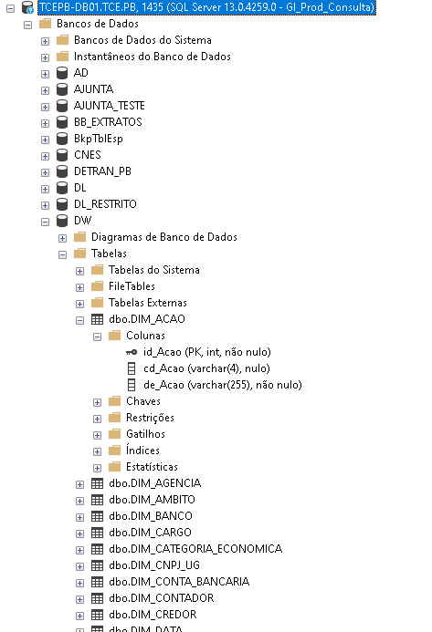

# SQL
## SELECT
Para extrair dados de banco de dados é utilizado o comando `SELECT` seguido das colunas desejadas e o comando `FROM` indicando onde as colunas indicadas após o `SELECT` estão. Todas as consultas em SQL terminam com um `;`.

e.g.:

**Produto**
| id_produto | nome | marca |
|:-:|:-:|:-:|
| 1 | Bola de Vôlei | Mikasa | 
| 2 | Bola de Futebol | Penalty |


**Vendedor**
| id_vendedor | nome |
|:-:|:-:|
| 1 | Marcos |
| 2 | Débora |

Ambas as tabelas possuem uma coluna `nome` por isso se faz necessário o comando `FROM`.

A formatação da consulta pode ser feita de diferentes formas, mas sempre terá no mesmo resultado contanto que os comando e a ordem deles seja a mesma.
```sql
SELECT
    nome
FROM Produto;
```

```sql
SELECT nome FROM Produto;
```

Ambas as consultas retornam a coluna:
| nome |
|:-:|
| Bola de Vôlei |
| Bola de Futebol |

Para consulta de várias colunas o nome dessas colunas são separados por vírgula:
```sql
SELECT
    nome,
    marca
FROM Produto;
```

```sql
SELECT nome, marca FROM Produto;
```

O resultado seria:
| nome | marca |
|:-:|:-:|
| Bola de Vôlei | Mikasa | 
| Bola de Futebol | Penalty |


E finalmente, para consultar todas as colunas disponíves é possível listar elas sepradas por vírgula ou digitar um `*` indicando "todas as colunas disponíveis".
```sql
SELECT
    *
FROM Produto;
```

```sql
SELECT * FROM Produto;
```

O resultado seria a tabela completa:
| id_produto | nome | marca |
|:-:|:-:|:-:|
| 1 | Bola de Vôlei | Mikasa | 
| 2 | Bola de Futebol | Penalty |

### Renomear coluna na consulta
Para renomear uma coluna basta logo após o nome dela inserir um `AS` e fazer o renome (caso sejam várias palavras colocar entre aspas ""):
```sql
SELECT
    nome AS "Nome do Produto",
    marca AS "Marca do Produto"
FROM Produto;
```

```sql
SELECT nome AS "Nome do Produto", marca AS "Marca do Produto" FROM Produto;
```
Resultado:
| Nome do Produto | Marca do Produto |
|:-:|:-:|
| Bola de Vôlei | Mikasa | 
| Bola de Futebol | Penalty |

## WHERE
a palavra `WHERE` é o filtro para a consulta do `SELECT` onde impõe condições para qualquer coluna desejada. Ao filtrar uma coluna de número basta digitar o número normalmente, mas ao filtrar coluna de texto inserir entre aspas únicas '', e.g.:
```sql
SELECT
    nome AS "Nome do Produto",
    marca AS "Marca do Produto"
FROM Produto
WHERE marca = 'Mikasa';
```
Resultado:
| Nome do Produto | Marca do Produto |
|:-:|:-:|
| Bola de Vôlei | Mikasa |

```sql
SELECT
    nome AS "Nome do Produto",
    marca AS "Marca do Produto"
FROM Produto
WHERE id_produto > 1;
```
Resultado:
| Nome do Produto | Marca do Produto |
|:-:|:-:|
| Bola de Futebol | Penalty |

O campo filtrado não precisa necessariamente aparecer na consulta (após o `SELECT`) para ser utilizado como filtro.

## Servidor utilizado em GI
O nome é SQL Server e a ferramenta utilizada para acessar os Bancos de Dados é o SQL Server Management Studio (SSMS) da Microsoft que pode ser baixado [aqui](https://learn.microsoft.com/pt-br/sql/ssms/download-sql-server-management-studio-ssms?view=sql-server-ver16).



Como existem vários Bancos de Dados diferentes, um jeito de direcionar no comando `FROM` para a tabela correta seria:
```sql
SELECT
    {coluna1},
    {coluna2},
    {coluna3}
FROM {Nome Bando de Dados}.{Nome da tabela};
```

e.g.:
```sql
SELECT
    id_Acao,
    de_Acao AS "Descrição Ação"
FROM DW.dbo.DIM_ACAO
WHERE id_Acao = 1;
```